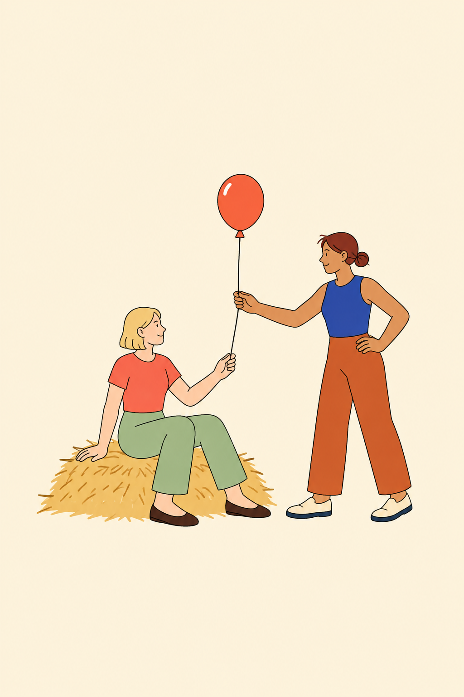
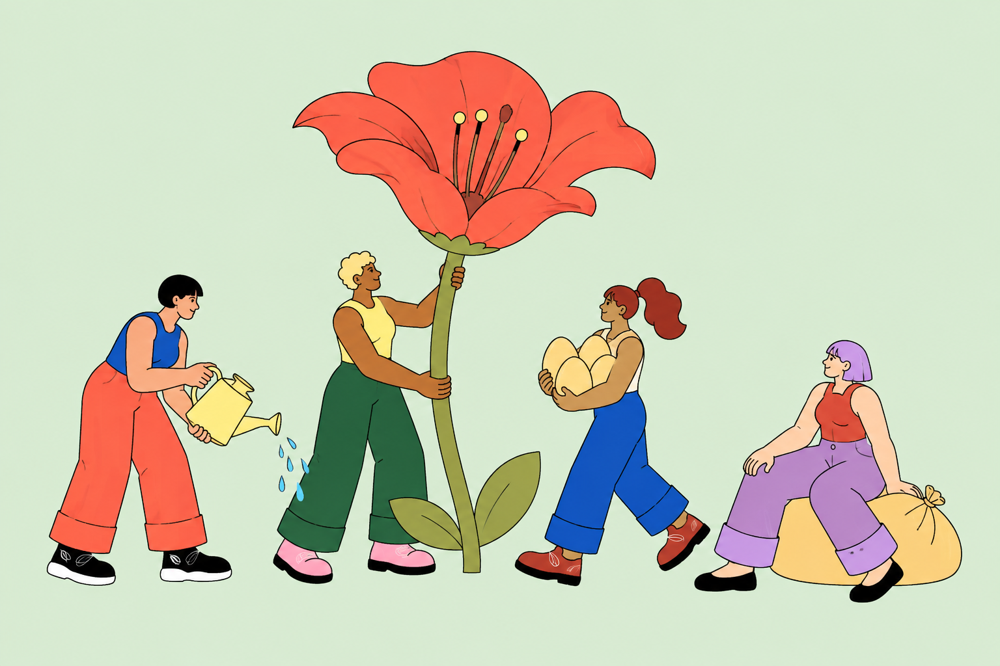
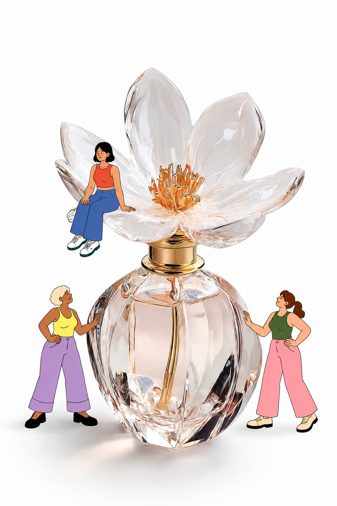
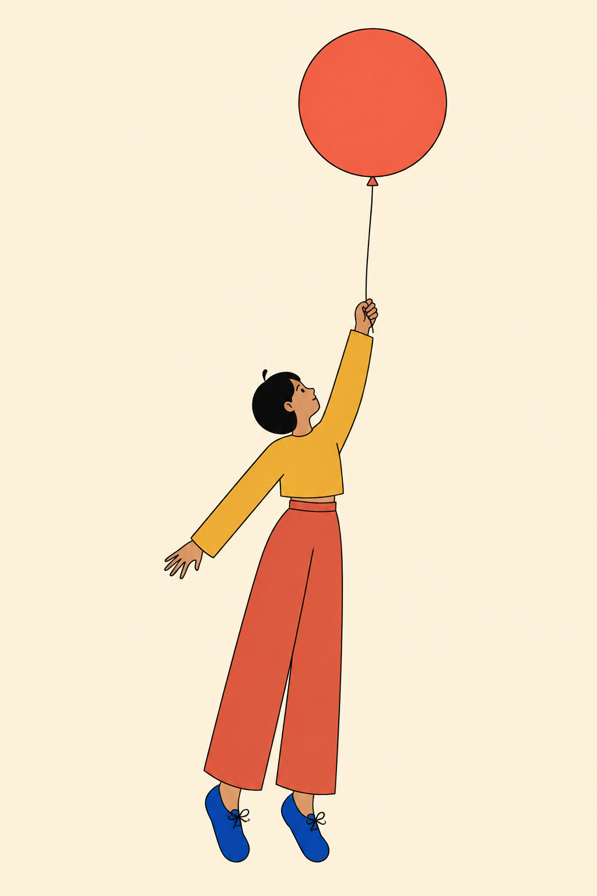
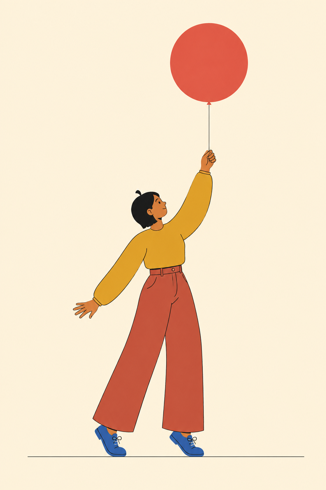
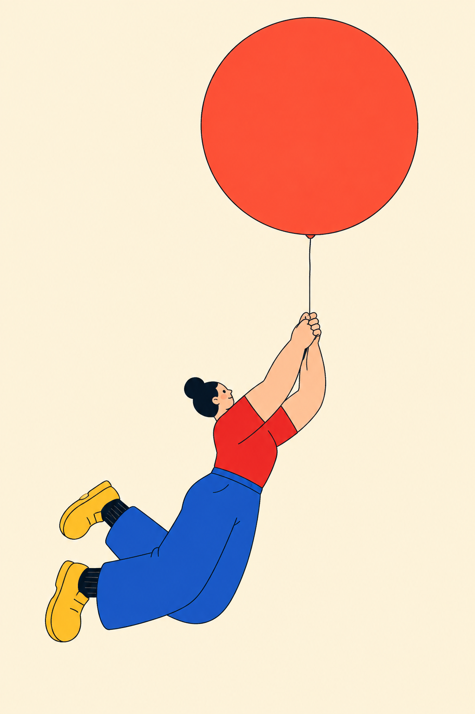
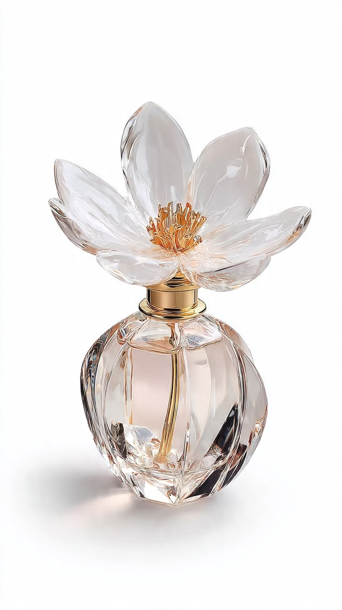
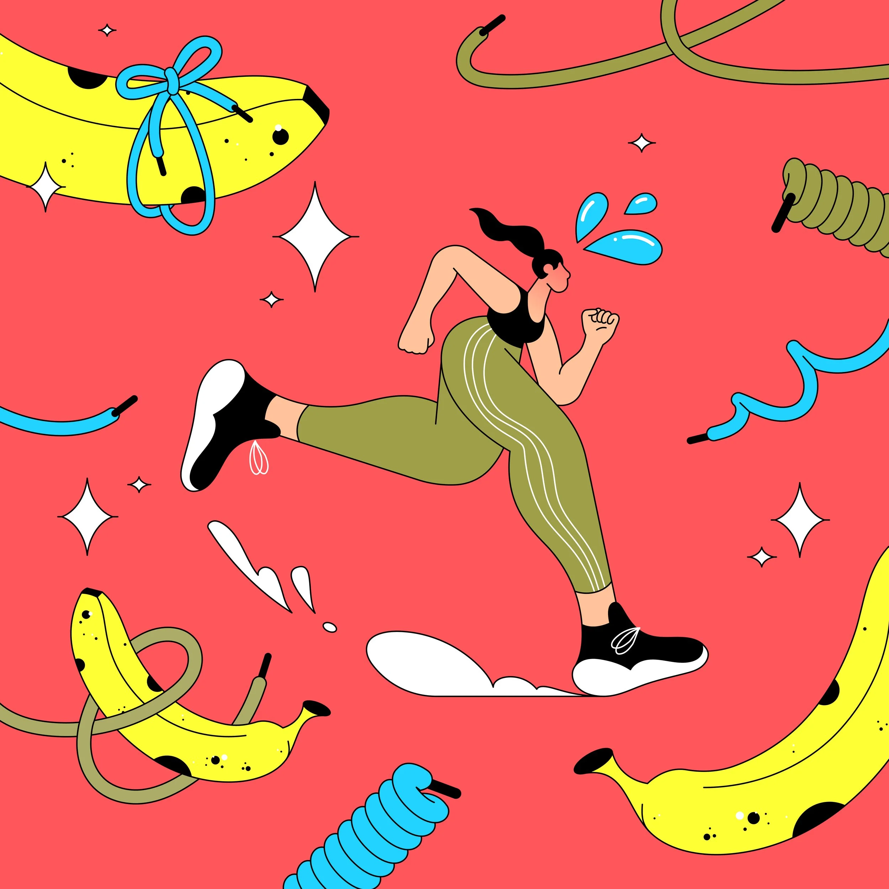
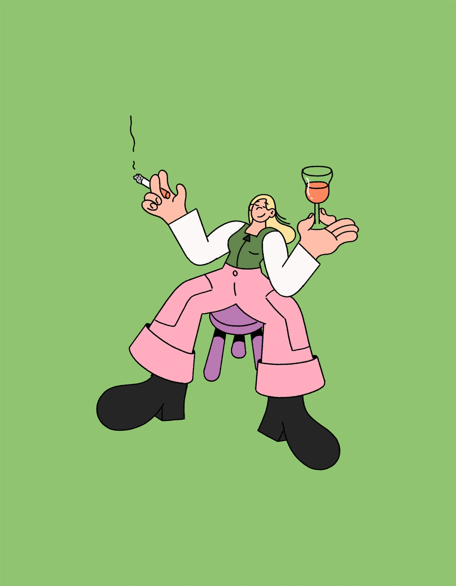

# pop-lilliput v13 cross-agent review

User-authorized review set. Generated images are tests, not original Linn Fritz artworks. Source images are labeled separately.

## User feedback

人物的约束更加严格了，这样出图一次成功的概率大大增加，也大大减少了风格漂移的概率。整体的设计很好，但是小人和原作的风格上面，还是有差距，只是一个更精致的小人。后续应该保持架构的同时，看下原作的头部，手部，手臂，大腿，头身比例等一系列细节和风格共同点，往更接近的风格上面去靠近，而且小人缺少原作的互动性，对参考图的互动。

Treat improved success rate as user assessment, not measured statistics. Review images independently before reading prior scores.

## 01-codex-balloon-pair.png

## 02-codex-four-garden.png

## 03-codex-perfume-three.png

## 04-workbuddy-balloon-v1.png

## 05-workbuddy-balloon-v2.png

## 06-kimi-balloon.png

## input-perfume.jpg

## source-M0437.webp

## source-M0583.webp

